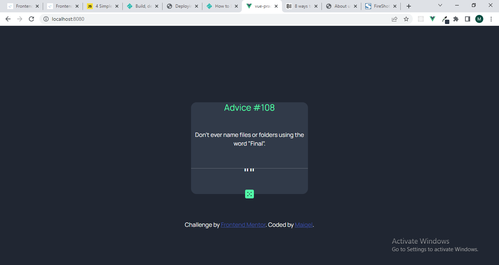

## Frontend Mentor - Advice generator app solution

This is a solution to the [Advice generator app challenge on Frontend Mentor](https://www.frontendmentor.io/challenges/advice-generator-app-QdUG-13db). Frontend Mentor challenges help you improve your coding skills by building realistic projects.

## Table of contents

- [Overview](#overview)
  - [The challenge](#the-challenge)
  - [Screenshot](#screenshot)
  - [Links](#links)
- [My process](#my-process)
  - [Built with](#built-with)
  - [What I learned](#what-i-learned)
  - [Continued development](#continued-development)
  - [Useful resources](#useful-resources)
- [Author](#author)

**Note: Delete this note and update the table of contents based on what sections you keep.**

## Overview
A web application what generates a random piece of advice when a button is clicked

### The challenge

Users should be able to:

- View the optimal layout for the app depending on their device's screen size
- See hover states for all interactive elements on the page
- Generate a new piece of advice by clicking the dice icon

### Screenshot




### Links

- Solution URL: [Add solution URL here](https://github.com/Maiqel1/advice-generator)
- Live Site URL: [Add live site URL here](https://musical-liger-148ad0.netlify.app/)

## My process

### Built with

- Semantic HTML5 markup
- CSS custom properties
- Mobile-first workflow
- [Vue.js](https:/vuejs.org/) - JS library
- [Bootstrap](https://getbootstrap.com) - HTML framework

### What I learned

Successfully used async await and fetch, this was a major milestone for be because ive struggled grestly with APIs in the past.
This project also helped reinforce my knowledge of vue.js and lifecycle hooks


```js
async getQuote() {
        const res = await fetch('https://api.adviceslip.com/advice')
        const data = await res.json()
        console.log(data);


        this.Quote= data["slip"]["advice"]
        this.Id = data.slip.id
      }
    },
    created() {
      this.getQuote()
    },
```

### Continued development

improving my understanding of javascript and learning to build more complex web applications.
Also want to more about APIs

### Useful resources

- [Example resource 1](https://javascript.plainenglish.io/4-simple-steps-to-get-started-with-the-fetch-api-2f3aafaca17d) - This helped me with the API endpoints. I really liked this pattern and will use it going forward.

## Author

- Frontend Mentor - [@yourusername](https://www.frontendmentor.io/profile/maiqel1)
- Twitter - [@yourusername](https://www.twitter.com/maiq_el)
